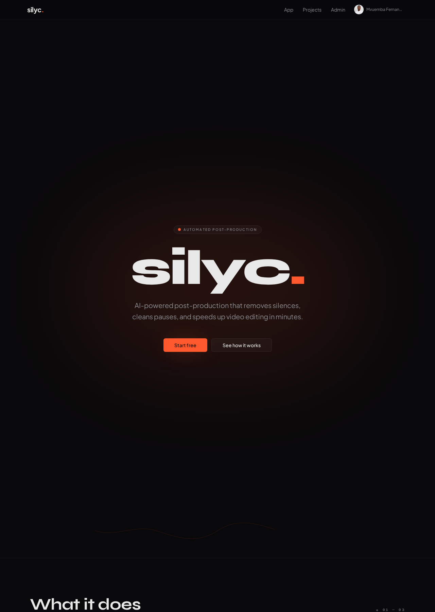
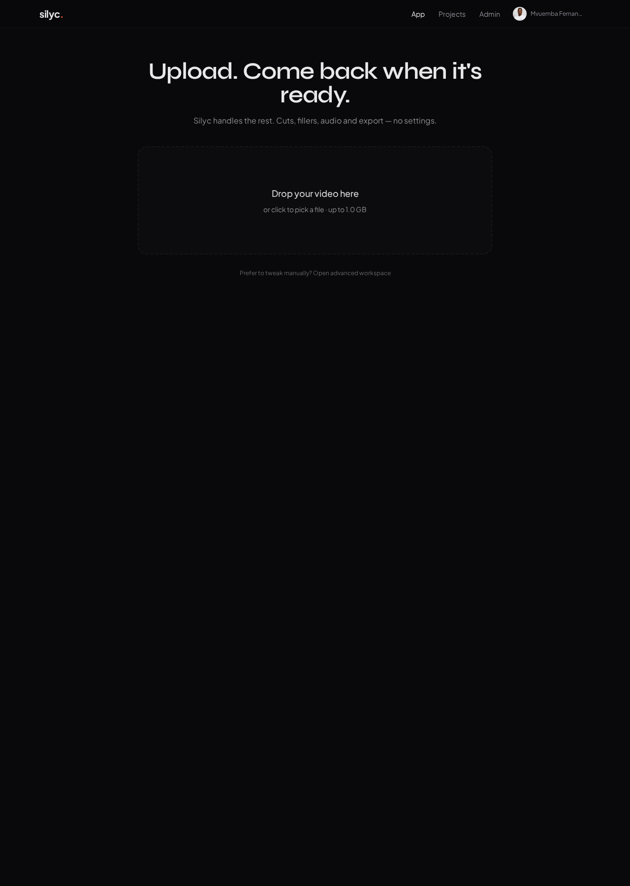
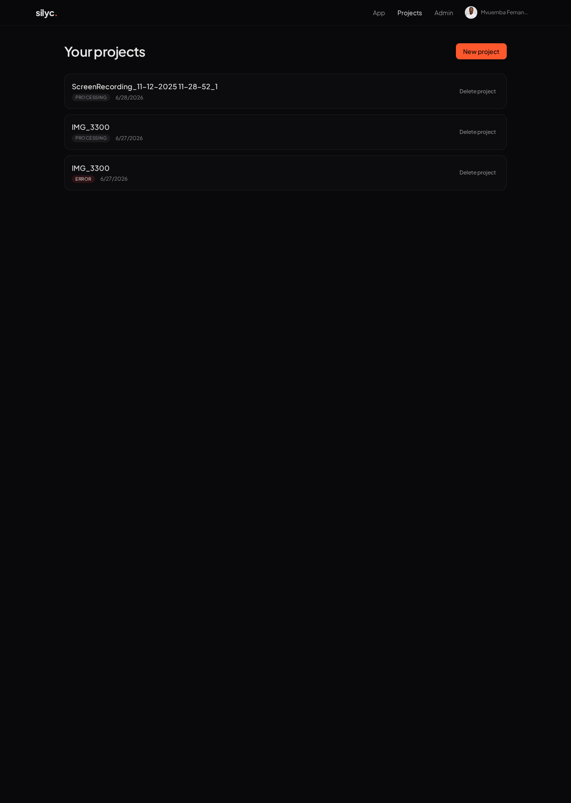
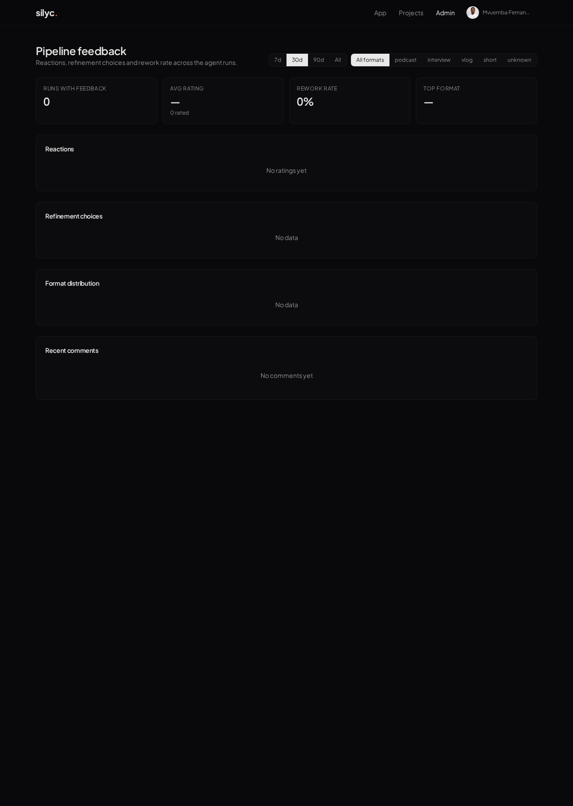

# silyc.

> Assistente inteligente de pós-produção de vídeo. Remove silêncios, masteriza áudio e prepara cortes precisos — direto no navegador, com fallback para nuvem quando necessário.

[](https://silycio.lovable.app)
[](#stack)
[](#backend-lovable-cloud)

---

## Visão geral

`silyc.` automatiza as tarefas repetitivas do editor: detecta silêncios com precisão de palavra, masteriza áudio com cadeia profissional e exporta o vídeo pronto. A engine roda no próprio navegador via **FFmpeg.wasm**, com escalonamento para **Replicate**, **fal.ai** e **Shotstack** quando o material exige modelos de IA ou render pesado.



## Funcionalidades

- **Detecção de silêncio** com WhisperX (timestamps por palavra) e fallback heurístico por SNR.
- **Cortes precisos** com padding configurável e fade-in de áudio para evitar cliques.
- **Mastering FFmpeg** — cadeia `highpass → afftdn → dynaudnorm → loudnorm` (-14 LUFS).
- **Denoise em nuvem** — orquestração Replicate → fal.ai → fallback local com retry/backoff.
- **Pré-visualização A/B** lado a lado e modo slider, em tela cheia e sincronizado.
- **Histórico por projeto** com versões, configurações e logs públicos da execução.
- **Recuperação de sessão** via snapshot em `localStorage` + aviso `beforeunload`.
- **Realtime** — status do job atualiza sozinho.
- **i18n** PT / EN persistido por usuário.
- **Cota e rate limit** server-side, com tela dedicada para 402 (sem créditos).



## Stack

### Frontend
- **TanStack Start v1** (React 19, SSR + server functions)
- **Vite 7** + **Tailwind CSS v4**
- **shadcn/ui** + Radix Primitives
- **TanStack Query** para data fetching
- **motion** para animações 60fps
- **Syne** + **Plus Jakarta Sans** (tipografia)

### Engine de vídeo
- **@ffmpeg/ffmpeg 0.12** (WASM, servido localmente)
- Pipeline unificado via `PostProductionAgent` (sequência de `TaskRunner`s)

### Backend (Lovable Cloud)
- Auth (Google OAuth + e-mail/senha)
- Postgres com RLS + `has_role` security definer
- Storage para uploads (limite 1 GB)
- Realtime para status de job
- Server functions protegidas por `requireSupabaseAuth`

### IA & Render
- **Replicate** — `victor-upmeet/whisperx`, `resemble-ai/resemble-enhance`
- **fal.ai** — fallback de denoise
- **Shotstack** — render em nuvem (opcional)

## Arquitetura

```text
┌──────────────┐   upload    ┌─────────────────────┐
│  Browser UI  │ ──────────► │ PostProductionAgent │
│ (TanStack)   │             │  ├─ AnalyzeAudio    │
└──────┬───────┘             │  ├─ DetectSilence   │
       │                     │  ├─ CutTimeline     │
       │ Realtime            │  ├─ MasterAudio     │
       ▼                     │  └─ Export          │
┌──────────────┐             └──────┬──────────────┘
│ Lovable Cloud│ ◄── server fns ────┤
│ (Postgres,   │                    │ cloud fallback
│  Auth, RT)   │                    ▼
└──────────────┘         ┌─────────────────────┐
                         │ Replicate · fal.ai  │
                         │      Shotstack      │
                         └─────────────────────┘
```

## Estrutura de pastas

```text
src/
├─ routes/              # File-based routing (TanStack)
│  ├─ __root.tsx        # Shell HTML + providers
│  ├─ index.tsx         # Landing
│  ├─ app.tsx           # Workspace (upload + processamento)
│  ├─ _authenticated/   # Rotas protegidas (projects, admin)
│  └─ api/public/       # Webhooks / health checks
├─ components/          # UI (shadcn + custom)
├─ lib/
│  ├─ agent/            # PostProductionAgent + tasks
│  ├─ ffmpeg-processor.ts
│  ├─ cloud-denoise.ts
│  ├─ resume-store.ts
│  ├─ credits.ts
│  └─ i18n.tsx
└─ integrations/supabase/  # auto-gerado, não editar
```

## Telas

### Projetos


### Admin / Uso


## Rodando localmente

```bash
bun install
bun run dev
```

Secrets (configurados via Lovable Cloud — não commitar `.env`):

| Secret | Uso |
|---|---|
| `REPLICATE_API_TOKEN` | WhisperX + Resemble Enhance |
| `FAL_KEY` | Fallback de denoise |
| `SHOTSTACK_API_KEY` | Render em nuvem (opcional) |

Health-check dos provedores de denoise:

```
GET /api/public/health/denoise
```

## Scripts

| Comando | Descrição |
|---|---|
| `bun run dev` | Dev server (Vite) |
| `bun run build` | Build de produção |
| `bun run build:dev` | Build de preview |
| `bun run lint` | ESLint |
| `bunx vitest run` | Testes (54 passando) |

## Segurança

- Todas as server functions sensíveis usam `requireSupabaseAuth`.
- `has_role` no schema privado.
- HIBP password protection ativo; anonymous sign-ins desabilitado.
- Rate limit Postgres-backed + `integration_caps` por usuário.
- Service role nunca exposta ao cliente.

## Roadmap

- [ ] Fase 2 — jobs persistidos server-side (sair e voltar de verdade)
- [ ] Reestruturar `/app` → `/projects/new`
- [ ] Notificação por e-mail ao concluir
- [ ] Color grading cinematográfico

## Licença

Proprietário © silyc. Todos os direitos reservados.